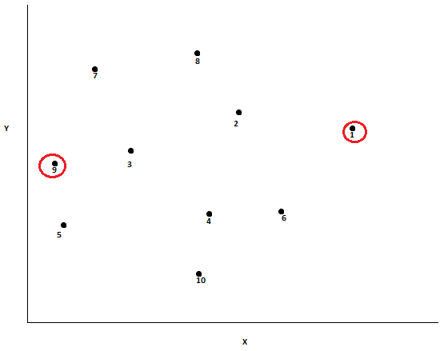
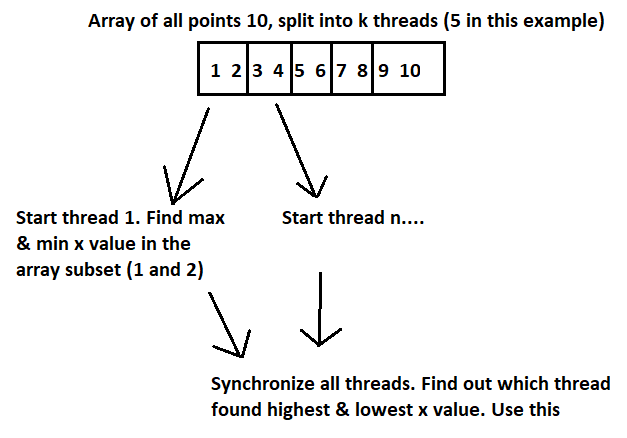
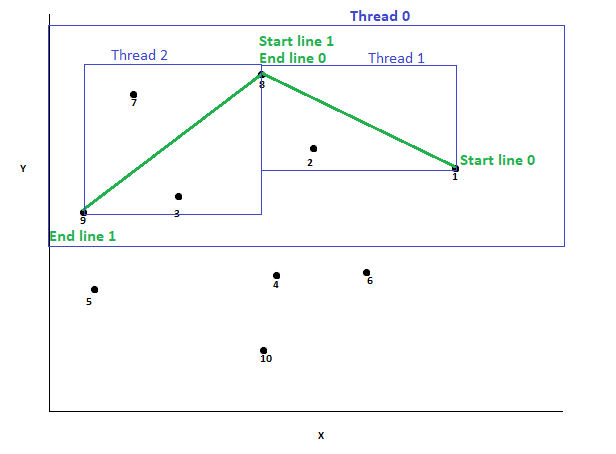
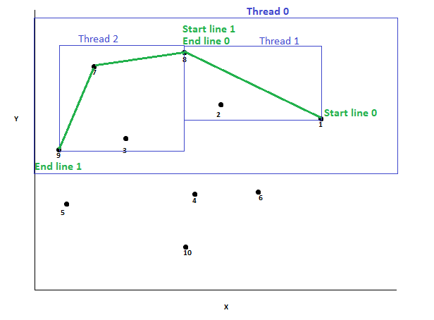
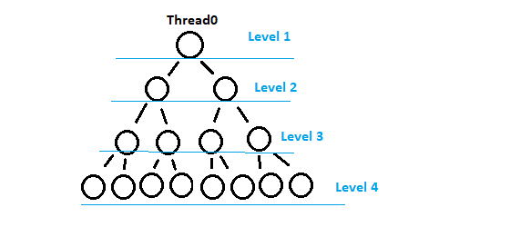
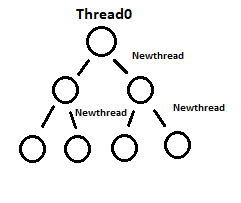

# IN4030-oblig-5

## Introduction – what this report is about
This report is about finding the Convex Hull of a set of Points in a Plane: A Recursive Geometric Problem. It involves a detailed description of how my approach to find
such convex holes sequentially. After the sequential approach, I'll elaborate on how to parallelize this in order to increase the efficiency of the algorithm. The report will also
explain in detail how such parallelization impacts the algorithm in terms of speedup and descriptions to why the speedup increases or decreases.


## 2. User guide – how to run your program (short, but essential), include a very simple example.
#### Build the program
Build the program by running the command:
   ```
   mvn clean install -Dskiptests
   ```

#### Run the program:
Run the program by running the command:
```
java -cp target/IN4030-oblig-5-1.0-SNAPSHOT.jar src.Main <m> <n> <seed> <threads>
```
- m - The mode to run. Can be either 0 (sequential), 1 (parallel) or 2 (benchmarking)
- n - The program will generate n amount of random numbers. 0 means it will generate for these numbers: 1000, 10 000,
  100 000, 1 mill, 10 mill og 100 mill
- seed - Seed to generating random numbers
- threads - how many threads to use in the parallel sorting. 0 means to use your computer's amount of cores.

#### Examples of running:
Run sequential algorithm for 100 000 points using seed 3 and all cores of the computer
```
java -cp target/IN4030-oblig-4-1.0-SNAPSHOT.jar src.MainParallelSort 100000 3 8 0
```

Running sequential vs parallel tests for the numbers 1000, 100 000, 1 mill etc.
```
java -cp target/IN4030-oblig-4-1.0-SNAPSHOT.jar src.MainParallelSort 0 3 8 0
```


## 3. Parallel version – how you did the parallelization – consider including drawings
First, we start by having an array of points and the initial approach is to find the point which has the highest and lowest X coordinate. As illustrated in drawing below

We parallelize the process of finding these points by diving the array of all points into k where k is the number of threads to use. Each thread found find a candidate which has lowest or lowest x value.
After all threads finished, the threads and synchronized, and the lowest & highest x value among all candidates is picked as illustrated below

We've now used parallelization & found the point which has the lowest X and the point which has the highest X.

The next step is to create a line between these points and thereafter to start measuring the distance which all other points has to this line.

Check out the Line class for seeing how this calculation is done. The method used for calculating the distance is called 'calcRelativeDistance'. If the return value of the
method is positive, it means that it's point is on the right side of the line. If it's negative, it means that the point is on the left side of the line. Of zero, it means that the point is on the line.

 
We're looking to find the point which is the furthest away from the line, meaning which has the lowest or highest value. In the search of this point, I also store if each point is on the left side, right side or on the line.

This initial search of finding point's which is the furthest away from the line is executed sequentially, as there's no benefits if more threads would perform the same task of finding the same external points.
Now that we've found the initial external points, we can start using both parallelism & recursion. We create a first thread which should handle the left side of the line by drawing 2 new lines as illustrated below

Now we continue doing the same procedure by finding most external point from both of these lines using recursion. Every time we find a new external point, it's added to the convex hull. In order to find the external point for both of these lines in parallel, we start a new thread for line 0
and another thread for line 1 as displayed below.

Thread 1 wont find any external points, however thread 2 will find the external point 7. So it will create a line to this point together with adding it to the result set.

Thread 2 will again spawn another 2 threads (1 per line) just like previously. Notice that we'll stop using threads once we're using k threads which is equal to amount of cores on the machine and rather compute the lines sequentially.


In my parallel solution, I'm evaluating if I should create a new thread once I've found an external point or not. I do this evaluation by using levels.
Every time we find a new external point, we add the 2 lines as described above. After this, we're supposed to do the recursive call. These recursive calls can be illustrated by a node tree. Once we do another recursive call, we enter next level of the node tree. If we're on level 1 - 3 we're
allowed to create a new thread which should perform the recursive call. If we're on level 4+, we're not allowed to create new threads and the recursive calls should be done sequentially. 


## 4. Implementation – a somewhat detailed description of how your Java program works & how tested


### Efficiency
In order to efficiently use the threads, spawning 2 threads per line is not necessary however. These recursive calls can be illustrated in a tree. Instead of the main thread creating 2 nodes and only awaiting for each of these nodes to complete, it can rather
compute one of the nodes itself as illustrated below:



### Finding the convex hull

We start by finding finding the two points which we see are obvious in the convex hull: the point with lowest x and the point with highest x.
If there's duplicates with same value, we just choose one.


Each line can be written as ax + by + c = 0. The line equation means that all points on this line satisfy the equation

Distance from line to other points
Check the docs regarding measuring the distance from a line to another point. If the point is on the left side of the line, it's positive & if it's onr hte right side of the line it's negative.
The further away from the line it is, the higher the number is.