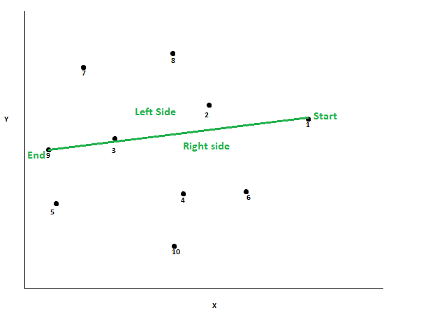
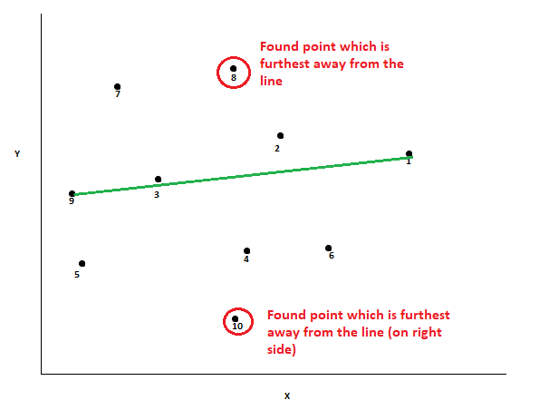
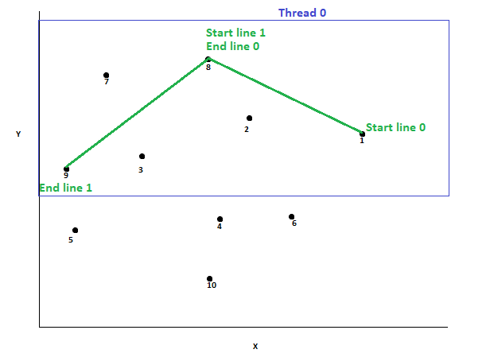
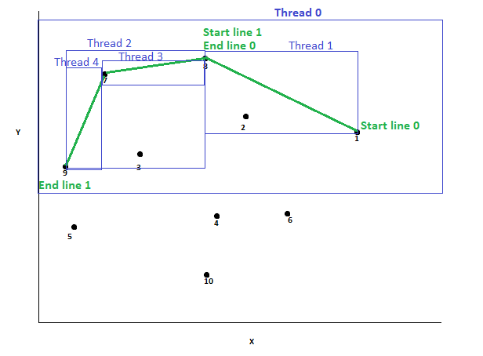
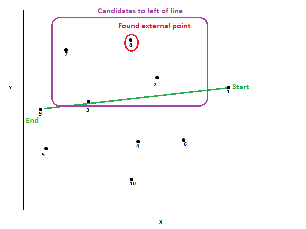
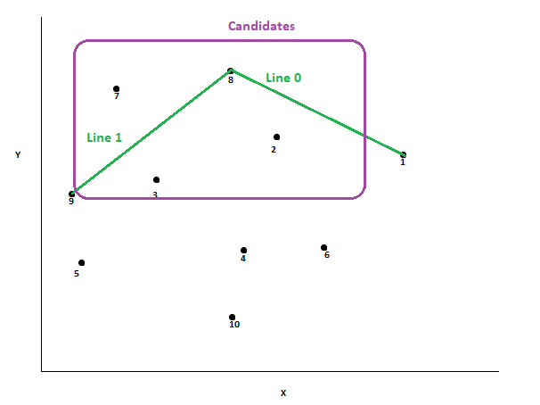
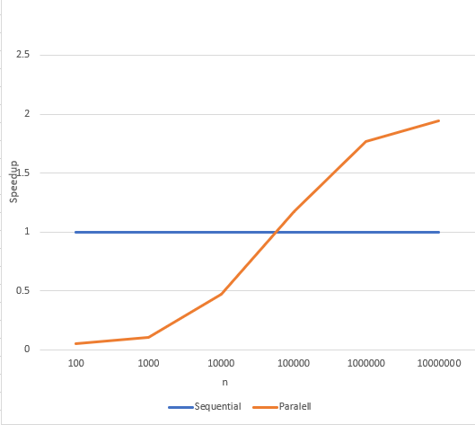
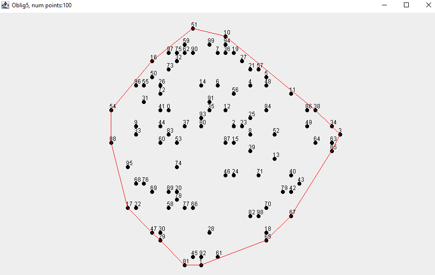

# IN4030-oblig-5

## Introduction – what this report is about
This report is about finding the Convex Hull of a set of Points in a Plane: A Recursive Geometric Problem. It involves a detailed description of how my approach to find
such convex holes sequentially. After the sequential approach, I'll elaborate on how to parallelize this in order to increase the efficiency of the algorithm. The report will also
explain in detail how such parallelization impacts the algorithm in terms of speedup and descriptions to why the speedup increases or decreases.


## 2. User guide – how to run your program (short, but essential), include a very simple example.
#### Build the program
Build the program by running the command:
   ```
   mvn clean install -Dskiptests
   ```

#### Run the program:
Run the program by running the command:
```
java -cp target/oblig-5-1.0-SNAPSHOT.jar src.Main <m> <n> <seed> <threads> <output>
```
- m - The mode to run. Can be either 0 (sequential), 1 (parallel) or 2 (benchmarking)
- n - The program will generate n amount of random numbers. 0 means it will generate for these numbers: 1000, 10 000,
  100 000, 1 mill, 10 mill og 100 mill
- seed - Seed to generating random numbers
- threads - how many threads to use in the parallel sorting. 0 means to use your computer's amount of cores.
- output - How to output the results. 0 means only writing to console, 1 means write to file & 2 means to draw output

#### Examples of running:
Run sequential algorithm for 100 000 points using seed 3 and all cores of the computer
```
java -cp target/oblig-5-1.0-SNAPSHOT.jar src.Main 0 100000 3 0 0
```

Run parallel algorithm for 1000 points using seed 2 and 4 cores of the computer and write to file
```
java -cp target/oblig-5-1.0-SNAPSHOT.jar src.Main 1 1000 2 4 1
```

Running sequential vs parallel tests for the numbers 1000, 100 000, 1 mill etc.
```
java -cp target/oblig-5-1.0-SNAPSHOT.jar src.Main 2 0 2 0 0
```


## 3. Parallel version – how you did the parallelization – consider including drawings
First, we start by having an array of points and the initial approach is to find the point which has the highest and lowest X coordinate. As illustrated in drawing below

We parallelize the process of finding these points by diving the array of all points into k where k is the number of threads to use. Each thread found find a candidate which has lowest or lowest x value.
After all threads finished, the threads and synchronized, and the lowest & highest x value among all candidates is picked as illustrated below

We've now used parallelization & found the point which has the lowest X and the point which has the highest X.

The next step is to create a line between these points and thereafter to start measuring the distance which all other points has to this line.

Check out the Line class for seeing how this calculation is done. The method used for calculating the distance is called 'calcRelativeDistance'. If the return value of the
method is positive, it means that it's point is on the right side of the line. If it's negative, it means that the point is on the left side of the line. Of zero, it means that the point is on the line.

 
We're looking to find the point which is the furthest away from the line, meaning which has the lowest or highest value. In the search of this point, I also store if each point is on the left side, right side or on the line.

This initial search of finding point's which is the furthest away from the line is executed sequentially, as there's no benefits if more threads would perform the same task of finding the same external points.
Now that we've found the initial external points, we can start using both parallelism & recursion. We create a first thread which should handle the left side of the line by drawing 2 new lines as illustrated below

Now we continue doing the same procedure by finding most external point from both of these lines using recursion. Every time we find a new external point, it's added to the convex hull. In order to find the external point for both of these lines in parallel, we start a new thread for line 0
and another thread for line 1 as displayed below.

Thread 1 wont find any external points, however thread 2 will find the external point 7. So it will create a line to this point together with adding it to the result set.

Thread 2 will again spawn another 2 threads (1 per line) just like previously. Notice that we'll stop using threads once we're using k threads which is equal to amount of cores on the machine and rather compute the lines sequentially.


In my parallel solution, I'm evaluating if I should create a new thread once I've found an external point or not. I do this evaluation by using levels.
Every time we find a new external point, we add the 2 lines as described above. After this, we're supposed to do the recursive call. These recursive calls can be illustrated by a node tree. Once we do another recursive call, we enter next level of the node tree. If we're on level 1 - 3 we're
allowed to create a new thread which should perform the recursive call. If we're on level 4+, we're not allowed to create new threads and the recursive calls should be done sequentially. 


## 4. Implementation – a somewhat detailed description of how your Java program works & how tested
The sequential version is implemented using recursion only. It does not spawn any threads but uses an approach much similar to what is described in chapter 3.
It finds external points, creates lines to such point and then performs the recursive procedure.

The parallel solution has the extensions of creating threads when we're at level 1-3. It reuses parts of the sequential algorithm, but instead does the steps
in a parallel manner. A more detaield procedure of the steps can be seen in chapter 3. 

### Efficiency
In order to efficiently use the threads, spawning 2 threads per line is not necessary however. These recursive calls can be illustrated in a tree. Instead of the main thread creating 2 nodes and only awaiting for each of these nodes to complete, it can rather
compute one of the nodes itself as illustrated below:


I've also made filtering of which candidates is available for the given line such that the algorithms doesnt check the distance from a line to every other point. This is done as following:
1. First we find min and max, then draw a line between these
2. Then we find the most external point. In this procedure, we store if each point is either to the left or to the right of the line. These points are stored as candidates for the next reccursive call.

3. So now that we're reccursivly drawing 2 lines to the external point & gonna check for distance between these lines & points, we only use the point candidates which was found earlier (2, 3, 7). This means we're not evaluating all points such as 10, 4 and 6 as we already eliminated those as candidates.


   

### Tested
The solution contains unit tests which was used for testing that the algorithms such that the parallel and sequential algorithm produces the same results for the same points.
I've also drawn the convex hull and checking that the convex hull looks correct.

### 5. Measurements – includes discussion, tables, graphs of speedups, number of cores used
Note: Time is in milliseconds
#### Cores used: 8

##### Results
| n     | Sequential    | Parallel  | Speedup|
|-------|---------------|-----------|--------|
|100   |0.0955         |1.855     |0.051   |
|1000  |0.216          |2.094      |0.103   |
|10000|1.338         |2.858      |0.468   |
|100000|5.711       |4.878     |1.170   |
|1000000|49.903     |28.281    |1.764   |
|10000000|468.836     |240.931    |1.945   |

The speedup of the parallel algorithm can be viewed in the following chart


#### Discussion of the speedups
From the speedup we can see that for lower numbers than 100000, we don't achieve any speedup. It means that when n < 100000, the sequential
algorithm perform faster than the parallel algorithm. The reason for this is likely due to the cost of thread creation being created, synchronized and thrown away (garbage collector). We see that that as
n increases, the efficiency of the parallel algorithm increases, illustrated by it's speedsup. It's due to that the overhead costs of creating, synchronizing and garbage collecting threads is less significant
once n increases and the benefits of running it in parallel is more significant due to there being a larger n. For n > 1000000, running it in parallel is the most efficient solution as we're dealing with high
numbers where parallelization process these points concurrently and the overhead cost of applying parallelization is less significant compared to the benefits we achieve from applying it. I'd also the speedup to continue increasing as n becomes larger.

There's also a limited requirement of synchronization overhead in this algorithm so all threads are able to do processing on the assigned data sets. Due to these circumstances, we see that
the speedup rises when n gets larger, and we can conclude that it's an algorithm which is worthy to parallelize due to this, especially when n gets large.

#### IN4030 benchmarks (Java Measurement Harness)
The harness can be run using the command:
```
java -jar target/benchmarks.jar
```

When I ran the harness, I got the following results for n = 100_000_00.
I've also written in console how long it took to generate the points for each iteration.
#### Parallel:
```
# Benchmark: src.Benchmarks.testParallel

# Run progress: 0.00% complete, ETA 00:01:20
# Fork: 1 of 1
# Warmup Iteration   1: Generating points took 1561.1067
Generating points took 1689.6032
Generating points took 1629.0507
Generating points took 1699.4933
Generating points took 1649.4339
Generating points took 1677.692
1.958 s/op
Iteration   1: Generating points took 1710.4643
Generating points took 1717.5999
Generating points took 1411.2843
Generating points took 1472.2494
Generating points took 1419.269
Generating points took 1508.4178
1.796 s/op
Iteration   2: Generating points took 1362.992
Generating points took 1480.6556
Generating points took 1444.1939
Generating points took 1588.6027
Generating points took 1622.1513
Generating points took 1497.5675
1.745 s/op
Iteration   3: Generating points took 1492.3441
Generating points took 1463.8847
Generating points took 1395.0064
Generating points took 1425.9899
Generating points took 1377.2316
Generating points took 1362.9882
Generating points took 1704.1056
1.712 s/op


Result "src.Benchmarks.testParallel":
  1.751 ±(99.9%) 0.776 s/op [Average]
  (min, avg, max) = (1.712, 1.751, 1.796), stdev = 0.043
  CI (99.9%): [0.976, 2.527] (assumes normal distribution)

```

#### Sequential

```
# Benchmark: src.Benchmarks.testSequential

# Run progress: 50.00% complete, ETA 00:00:45
# Fork: 1 of 1
# Warmup Iteration   1: Generating points took 1668.3747
Generating points took 1475.5282
Generating points took 1534.151
Generating points took 1391.8755
Generating points took 1509.9572
2.006 s/op
Iteration   1: Generating points took 1444.4288
Generating points took 1478.3047
Generating points took 1445.559
Generating points took 1429.6035
Generating points took 1419.5534
Generating points took 1378.248
1.871 s/op
Iteration   2: Generating points took 1607.1257
Generating points took 1573.8346
Generating points took 1797.5485
Generating points took 1830.0156
Generating points took 1963.9043
2.265 s/op
Iteration   3: Generating points took 1996.7258
Generating points took 1930.0513
Generating points took 2243.4082
Generating points took 1992.8568
2.562 s/op


Result "src.Benchmarks.testSequential":
  2.233 ±(99.9%) 6.323 s/op [Average]
  (min, avg, max) = (1.871, 2.233, 2.562), stdev = 0.347
  CI (99.9%): [? 0, 8.556] (assumes normal distribution)

```

#### Comparison:
```
Benchmark                  Mode  Cnt  Score   Error  Units
Benchmarks.testParallel    avgt    3  1.751 ± 0.776   s/op
Benchmarks.testSequential  avgt    3  2.233 ± 6.323   s/op
```

For these tests I chose to run the tests with warmup = 1. It means that it warms up by running once without recording speed before starting the operations of sorting the algorithms.
The measurement here is the average time it took to run the algorithm out of 3 runs. For the parallel algorithm we see that it's taking on average 1.751ms to run. The reason why it's taking longer
than in the previous measurements (without harness) is because these times includes the time used to generate data points. Generating such points around 1.5 second.  The sequantial algorithm on the other hand
takes around 2.233ms to run on average. From these results in the harness, we can see the similar behaviour as for the previous measurements. The parallel execution performs faster than the sequential one for high
numbers (n). Due to the overhead of creating data points on both the parallel & sequential run, this has to be taken into consideration when seeing the comparison.  We can also notice in the parallel algorithm
that the warmup run takes longer time than the others. Running a warmup run can make the following runs more optimized as we see from these results.

### 6. Conclusion – just a short summary of what you have achieved
In this project, I've managed to create both a sequential and a parallel algorithm which is able to create convex holes when there's n points. From the results, we see that
as n increase, the parallel algortihm becomes increasingly more efficient compared to the sequential algorithm. This also goes the other way, meaning that doing this sequential is more efficient for lower numbers.
The convex holes generated in this program has been tested using both unit tests and priting of results to make sure they are correct. Forinstance for n = 100, the following convex hole is produced:

In solving such convex holes, using recursion has been a crucial part of the methodology. The parallel solution has also been using thread creation recursively to efficient find such holes.